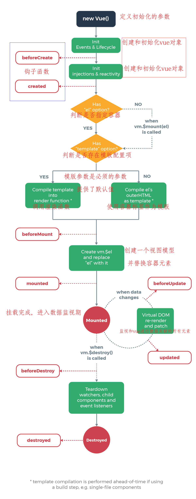
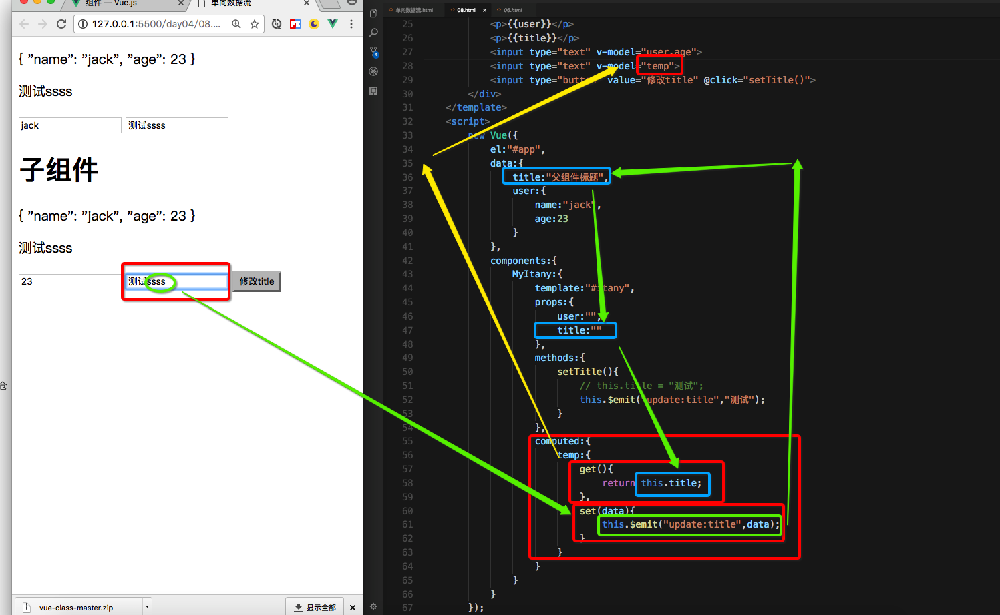

# Vue.js 

[TOC]

### 一、Vue.js 简介

​	Vue.js (读音 /vjuː/，类似于 **view**) 是一套构建用户界面的**渐进式框架**。与其他重量级框架不同的是，Vue 采用自底向上增量开发的设计。Vue 的核心库只关注视图层，它不仅易于上手，还便于与第三方库或既有项目整合。

​	MVVM  只关心视图和数据的交互操作

+ 作者：尤雨溪


### 二、起步

#### 1、下载vue.js 的支持库

`npm install vue`  下载核心库    vue.js    vue.min.js

#### 2、Hello world

+ JS+JSON 实现 所有功能
+ Vue中存在版本差异
  + vue 1.x   ： 可以对页面中的 body 标签进行 容器指定
  + vue 2.x   ：  不允许指定 body 标签为 容器，只能是 body 中的其它标签

```html
<!DOCTYPE html>
<html lang="en">
<head>
    <meta charset="UTF-8">
    <meta name="viewport" content="width=device-width, initial-scale=1.0">
    <meta http-equiv="X-UA-Compatible" content="ie=edge">
    <script src="../js/vue.js"></script>
    <!-- 
        阻止了 浏览对vue 的调试
        vue  的调试信息显示
     -->
    <!-- <script src="../js/vue.min.js"></script> -->
    <title>Vue hello world</title>
</head>
<body>
    <!--
        1、在页面中提供一个容器 ，用于为当前框架展示数据
        2、通过js 代码实现 vue 初始化 ，完成容器和vue之间的关联
    -->
    <div id="app">
        <!-- 插值表达式 -->
        {{hello}}
    </div>

    <script>
        // 全局配置项的配置
        Vue.config.devtools = false;
        Vue.config.productionTip = false;
        Vue.config.silent = true;    

        // 实例化 new（初始化） vue 对象
        // new Vue(opt:Object);
        new Vue({
            // 通过css的基础选择器语法 完成 元素和Vue对象的关联
            el:"#app",
            // 用于存储和页面间的通信数据
            data:{
                hello:"hello Vue 2333"
            }
        });
    </script>
</body>
</html>
```

```html
<!DOCTYPE html>
<html lang="en">
<head>
    <meta charset="UTF-8">
    <meta name="viewport" content="width=device-width, initial-scale=1.0">
    <meta http-equiv="X-UA-Compatible" content="ie=edge">
    <title>实例挂载</title>
    <script src="../js/vue.js"></script>
    <script>
        window.onload = function(){
            // 返回值  new Vue创建的对象
            var vm = new Vue({
                data:{
                    msg:"挂载显示消息"
                }
            });

            // vm ==> viewMode  ==>  对于mvvm框架创建的对象，一般使用vm进行表示
            // 挂载 元素对象  （容器）
            vm.$mount("#app");

            new Vue({
                data:{
                    name:"itany"
                },
                template:"<h1>这是模版</h1>"
            }).$mount("#itany")

        };
    
    </script>
</head>
<body>
    <div id="app">
        {{msg}}
    </div>
    <div id="itany">
        {{name}}
    </div>
</body>
</html>
```


#### 3、全局配置项

+ 对整个Vue 的运行环境进行配置
  + silent    取消所有的信息和日志警告
  + optionMergeStrategies  自定义合并策略的选项。
  + devtools    设置开发工具是否可用
  + errorHandler    定义vue 页面出现错误时的 处理函数
  + warnHandler    定义vue 页面出现警告时的 处理函数
  + ignoredElements  须使 Vue 忽略在 Vue 之外的自定义元素 
  + keyCodes    设置键盘映射表 ==>  后续课程进行讲解
  + performance   对浏览器的开发工具进行性能检测的
  + productionTip   生产环境的提示消息


#### 4、生命周期

+ 创建到消亡的过程
  + Vue 对象的 创建到消亡的过程



### 三、模版语法

#### 1、插值

+ 语法 `{{}}`

 #### 1.1普通文本的插入

```html
<div>{{msg}}</div>
```

#### 1.2 HTML 标签的插入

+ 直接使用  {{}}  进行带有标签的字符串写入时，类似于  JQUERY  text()
+ 插值表达式 不可以写入 html标签   （不能解析HTML标签）  ==>  指令
+ 指令后 可以直接写 简单的 JS 表达式

#### 1.3 js 脚本

+ 可以执行  简单的  js 表达式

```html
<!DOCTYPE html>
<html lang="en">
<head>
    <meta charset="UTF-8">
    <meta name="viewport" content="width=device-width, initial-scale=1.0">
    <meta http-equiv="X-UA-Compatible" content="ie=edge">
    <script src="../js/vue.js"></script>
    <script>
        window.onload = ()=>{
            new Vue({
                el:"#app",
                data:{
                    msg:"文本消息",
                    html:"<h4>标签文本</h4>"
                }
            });
        }
    </script>
    <title>插值表达式</title>
</head>
<body>
    <div id="app">
        <h4>{{msg}}</h4>
        <div>
            {{html}}
        </div>
        <h4>js 表达式</h4>
        <div>{{ 1+1 }}</div>
        <div>{{ 10/3 }}</div>
        <div>{{ 10%3 }}</div>
        <div>{{ 1==1 ? "true":"false" }}</div>
        <!-- ++ …… 不能执行 -->
        <!-- <div>{{ ++num }}</div> -->
    </div>
</body>
</html>
```


#### 2、指令

+ Vue中所指的指令是  以 `v-` 开头的元素属性  ,这些特殊的属性称之为 Vue的指令
+ 指令参数   在相关指令后  以   :   的方式对该指令进行参数传递， v-on:click
+ 指令修饰符 修饰符定义在 指令的后面 . 方式表示，用于做限制和判断

##### 2.1 v-text 

+ 功能和 {{}}  一样 做文本写入操作
+ 依赖于一个标签，值是写在 标签中的

```html
<!DOCTYPE html>
<html lang="en">
<head>
    <meta charset="UTF-8">
    <meta name="viewport" content="width=device-width, initial-scale=1.0">
    <meta http-equiv="X-UA-Compatible" content="ie=edge">
    <script src="../js/vue.js"></script>
    <script>
        window.onload = ()=>{

            new Vue({
                el:"#app",
                data:{
                    msg:"文本消息"
                }
            });
        }
    </script>
    <title>指令</title>
</head>
<body>
    <div id="app">
        <h4>{{msg}}</h4>
        <h4 v-text="msg"></h4>
    </div>
</body>
</html>
```


##### 2.2 v-html

+ 将输入html 字符串以解析的方式写入到页面

```html
<!DOCTYPE html>
<html lang="en">
<head>
    <meta charset="UTF-8">
    <meta name="viewport" content="width=device-width, initial-scale=1.0">
    <meta http-equiv="X-UA-Compatible" content="ie=edge">
    <script src="../js/vue.js"></script>
    <script>
        window.onload = ()=>{
            new Vue({
                el:"#app",
                data:{
                    html:"<h4>标签文本</h4>",
                }
            });
        }
    </script>
    <title>指令</title>
</head>
<body>
    <div id="app">
        <div>{{html}}</div>
        <div v-html="html"></div>
    </div>
</body>
</html>
```


##### 2.3 v-on 

+ 事件绑定
+ v-on 使用需要去配合参数进行使用，参数就是元素的事件，就是原始的HTML的事件名
+ v-on 监听HTML 的原始DOM事件，指定的方法定义方式和原生的方法定义方式一样
+ 绑定的事件一定要是在创建的Vue对象中所指定的事件，事件方法是定义在 methods 中
+ 提供 简写方式   `v-on:事件`   ==>  `@事件`

```html
<!DOCTYPE html>
<html lang="en">
<head>
    <meta charset="UTF-8">
    <meta name="viewport" content="width=device-width, initial-scale=1.0">
    <meta http-equiv="X-UA-Compatible" content="ie=edge">
    <script src="../js/vue.js"></script>
    <script>
        window.onload = ()=>{
            new Vue({
                el:"#app",
                data:{
                    msg:"文本消息",
                }
                methods:{
                    show:function(){
                        this.msg = "aaaa";
                    }
                }
            });
        }
    </script>
    <title>指令</title>
</head>
<body>
    <div id="app">
        <h4>{{msg}}</h4>
      
        <input type="button" value="按钮" v-on:click="show()">
    </div>
</body>
</html>
```

+ 增减修饰符
  + 定义键盘拦截
  + 阻止冒泡 、默认事件


```html
<!DOCTYPE html>
<html lang="en">
<head>
    <meta charset="UTF-8">
    <meta name="viewport" content="width=device-width, initial-scale=1.0">
    <meta http-equiv="X-UA-Compatible" content="ie=edge">
    <style>
        .div1{
            width: 300px;
            height: 300px;
            border: 1px solid black;
        }
        .div2{
            width: 200px;
            height: 200px;
            border: 1px solid black;
        }
        .div3{
            width: 100px;
            height: 100px;
            border: 1px solid black;
        }
    
    </style>
    <script src="../js/vue.js"></script>
    <title>Document</title>
    <!-- 
        1、阻止默认行为
        2、阻止冒泡

        .stop - 调用 event.stopPropagation()。
        .prevent - 调用 event.preventDefault()。  阻止默认事件
        .self - 只当事件是从侦听器绑定的元素本身触发时才触发回调。
    -->
    <script>
        window.onload = function(){
            new Vue({
                el:"#app",
                methods:{
                    fun1(){
                        console.log("被点了");
                    },
                    fun2(){
                        console.log("fun2");
                    },
                    fun3(){
                        console.log("fun3");
                    },
                    fun4(){
                        console.log("fun4");
                    },
                    fun5(){
                        console.log("fun5");
                    }
                }
            });
        }
    
    </script>
</head>
<body>
    <!-- a 标签的 点击事件 默认行为 就是 跳转页面 -->
    <a href="http://www.baidu.com">百度</a>
    <div id="app">
        <a href="http://www.baidu.com" v-on:click.prevent >百度</a>
        <a href="http://www.baidu.com" v-on:click.prevent="fun1()" >百度</a>
        <hr>
        <!-- 事件冒泡 -->
        <div class="div1" v-on:click.self="fun5()">
            <div class="div2" v-on:click="fun4()">
                <div class="div3" v-on:click="fun3()">
                    <span v-on:click.stop="fun2()">测试</span>
                </div>
            </div>
        </div>
    </div>
</body>
</html>
```


##### 2.4 v-bind

+ 元素属性绑定，class  style 普通属性该如何处理
  + 普通属性
  + class
  + style
+ `v-bind`  的简写方式   `:属性`

```html
<!DOCTYPE html>
<html lang="en">
<head>
    <meta charset="UTF-8">
    <meta name="viewport" content="width=device-width, initial-scale=1.0">
    <meta http-equiv="X-UA-Compatible" content="ie=edge">
    <style>
        .aa{
            width: 100px;
            height: 100px;
            background-color: rebeccapurple;
        }
        .bb{
            color: white;
        }
        .cc{
            color: blue;
        }
        .fs{
            font-size: 20px;
        }
    </style>
    <script src="../js/vue.js"></script>
    <title>v-bind 的使用</title>
    <script>
        window.onload = function(){
            new Vue({
                el:"#app",
                data:{
                    w:"100px",
                    h:"100px",
                    imgurl:"../img/生命周期.png",
                    statu:true,
                    // aa:"aa bb",
                    divStyle:"aa",
                    colorStyle:"bb",
                    flag:true,
                    clazz:{aa:true,bb:true,cc:false},
                    style1:{color:'red'},
                    style2:{fontSize:'30px'}
                },
                methods:{
                    change(){
                        this.w = "200px";
                        this.h = "200px";
                        this.imgurl = "http://www.baidu.com/img/bd_logo1.png";
                    },
                    changeColor(){
                        // this.colorStyle = "cc";
                        this.colorStyle = this.colorStyle == "bb"? "cc":"bb";
                    },
                    changeFlag(){
                        this.flag = !this.flag;
                    }
                }
            });
        }
    
    </script>
</head>
<body>
    <div id="app">
        <h1>普通属性的绑定</h1>
        <!-- 
            指令后面的  “”  中指定是 vue 实例中 data 中的变量名
         -->
        <button type="button" @click="change()">改变大小</button>
        
        <hr>
        <!--
            Vue 中对于互斥属性 一般可以直接使用  boolean 进行状态的选择
            Vue 对于 复选单选，下拉列表，存在一种特殊的 选中方式？
            ……
        -->
        <input type="checkbox" :checked="statu">
        <hr>
        <!-- class的绑定 -->
        <!-- <div class="aa bb"></div> -->
        <!-- 1、变量的定义方式 -->
        <!-- <div :class="aa"> -->
        
        <!-- 2、数组的定义方式 -->
        <div :class="[divStyle,colorStyle]">
            div1
        </div>
        <input type="button" value="变变变" @click="changeColor()">

        <!-- 
            3、JSON 定义方式     (常用)
                key 使用 样式名
                value  boolean
            可以处理互斥样式
                success error
        -->
        <div :class="{aa:true,bb:false,cc:true}">
            div2
        </div>
        <div class="fs" :class="{aa:true,bb:flag,cc:!flag}" @click="changeFlag()">
            div3
        </div>
        <!-- 
            4、变量json 的方式进行定义
         -->
         <div :class="clazz">
             div4
         </div>
        <!-- 对于 style 的绑定 -->
        <div style="color:red; font-size:30px" >div5</div>
        <!--
            key 样式名称   ==> 遵循 原生 JS 的Style操作方式   xxx-yyy-zzz ==> xxxYyyZzz
            value 是样式的值
        -->
        <div :style="{color:'red',fontSize:'30px'}">
            div6
        </div>
        <!-- 
            可以取数组对象
         -->
         <div :style="[{color:'red'},{fontSize:'30px'}]">
             div7
         </div>
         <div :style="[style1,style2]">
            div8
        </div>
    </div>
</body>
</html>
```


##### 2.5 v-model

+ 双向数据绑定，经常用在表单属性中
+ .lazy 修饰符  用于定义input 框的  光标移开事件
+ v-model 双向数据绑定对于表单元素的影响

```html
<!DOCTYPE html>
<html lang="en">
<head>
    <meta charset="UTF-8">
    <meta name="viewport" content="width=device-width, initial-scale=1.0">
    <meta http-equiv="X-UA-Compatible" content="ie=edge">
    <script src="../js/vue.js"></script>
    <script>
        window.onload = ()=>{
            new Vue({
                el:"#app",
                data:{
                    str:"aaa"
                }
            });
        }
    </script>
    <title>指令</title>
</head>
<body>
    <div id="app">
        <input type="text" v-model="str">
        <input type="text" v-model="str">
        <h4>{{str}}</h4>
    </div>
</body>
</html>
```


##### 2.6 v-pre

+ 完整显示 == 让当前标签中的 {{}} 不去做解析，作为文本在页面中显示


##### 2.7 v-cloak

+ 解决页面闪烁问题
+ 该属性单独使用无效，需要配合自定义CSS样式
+ 需要定义  css 样式  ` [v-cloak]{display: none; }`


##### 2.8 v-once

+ 只绑定一次，在Vue对象创建时 指定该属性的元素只会渲染一次，后需要Vue数据发生变化不会再影响到该标签


##### 2.9 v-if

+ 判断，根据boolean类型判断，用于决定绑定了v-if的元素是否显示
+ 根据结果 选择 创建元素还是不创建元素


##### 2.10 v-show

+ 判断，根据boolean类型判断，用于决定绑定了v-show的元素是否显示
+ 会直接创建DOM 元素，但根据 display: none; 方式进行元素的隐藏


##### 2.11 v-else 和 v-else-if

+ v-else 和 v-else-if 不可以单独使用 ，必须配合 v-if 使用


##### 2.12 v-for

+ 对绑定 v-for 的元素做循环操作


### 四、自定义指令 

+ 全局自定义：在所有的Vue 实例中都可以使用


+ 局部自定义：在指定的Vue 实例中才可以使用


### 五、自定义过滤器

+ Vue 1.x 版本中  集成了大量的内置过滤器，字符串转换、时间转换……
+ Vue 2.x 删除了所有内置过滤器 ==> 自定义内置过滤器 \==> 使用三方过滤器

- 全局自定义：在所有的Vue 实例中都可以使用
- 局部自定义：在指定的Vue 实例中才可以使用


### 六、计算属性

+ 使用缓存的方式处理过滤器的功能


+ 结果过程 类似于过滤器
+ 过滤器每次调用都会执行一次运算过程，计算的结果不会缓存
+ 计算属性在其依赖属性未发生变换时，运算过程只会执行一次，计算的记过会被缓存，直到依赖属性发生变换才会再次计算
+ 计算属性 默认 只提供 单向数据绑定操作  ==> 只能取值 不能赋值

```html
<!DOCTYPE html>
<html lang="en">
<head>
    <meta charset="UTF-8">
    <meta name="viewport" content="width=device-width, initial-scale=1.0">
    <meta http-equiv="X-UA-Compatible" content="ie=edge">
    <script src="../js/vue.js"></script>
    <title>计算属性</title>
</head>
<body>
    <div id="app">
        <input type="text" v-model="num">
        <hr>
        <h1>{{num}} > 10 : {{ num | number}}</h1>
        <h1>{{num}} > 10 : {{ num | number}}</h1>
        <h1>{{num}} > 10 : {{ num | number}}</h1>
        <h1>{{num}} > 10 : {{ num | number}}</h1>
        <hr>
        <h1>{{num}} > 10 : {{ result }}</h1>
        <h1>{{num}} > 10 : {{ result }}</h1>
        <h1>{{num}} > 10 : {{ result }}</h1>
        <h1>{{num}} > 10 : {{ result }}</h1>
        <hr>
        <input type="text" v-model="result">
        <hr>
        <input type="text" v-model="num2">
        <input type="text" v-model="addNum">
        <input type="text" v-model="num3" @change="setNum2()">
        <h1>{{num2}}:{{addNum}}</h1>
        
    </div>
    <script>
        Vue.filter("number",function(data){
            console.log("过滤器:",Math.random());
            return data>10
        });

        new Vue({
            el:"#app",
            // 普通属性值
            data:{
                num:6,
                num2:1,
                num3:0
            },
            // 计算属性值
            computed:{
                // name:Function
                // 1、计算属性所对应的function 不能使用 => 函数 
                //     使用=> 函数 不能保证 计算属性函数中的this是当前的 Vue 实例
                // 2、计算属性的函数一定要有返回值
                result:function(){  //get 方法
                    // 增加一些其他的判断获取逻辑流程
                    console.log("计算属性：",Math.random());
                    return this.num > 10;
                },
                // getter  缺少  setter
                //  get set 方法  用于表示对一个参数的取值和赋值的两种操作
                // addNum:function(){
                //     return parseInt(this.num2)*2;
                // }
                addNum:{
                    get:function(){
                        return parseInt(this.num2)*2;
                    },
                    // set 必须和 依赖属性进行关联
                    // set 和自己进行关联 会造成死循环
                    set:function(value){
                        // console.log(value);
                        // this.addNum = parseInt(value)/2;
                        this.num2 = parseInt(value)/2;
                    }
                }
            },
            methods:{
                setNum2(){
                   this.num2 = this.num3/2;
                }
            }
        });
    </script>
</body>
</html>
```


### 七、过渡效果

+ 提供简单的方式实现CSS动画效果
+ 会和Vue实例中的数据做关联

#### 1、基础应用

+ 生命周期
  + 开始  过渡  结束
  + 开始前 开始  开始后  过渡前 过渡 过渡后 结束前 结束 结束后
  + 对于DOM元素需要添加动画 ，将该元素放置在  `<transition  >DOM</transition>`
+ transition  只用于定义单元素动画
+ transition-group  定义多元素动画  一定要在子元素上 绑定一个 key 属性
  + key 用于区分动画的加载元素


### 八、Vue 对象的实例方法

+ 堆栈空间的数据存储
+ 对于vue 而言，所有的实例属性都具有两种表现形式（watch除外）
  + vm.$名称   对象调用
  + Vue.名称    全局调用
+ vm.$set 或者 Vue.set   : 为新增减的属性完成  getter 和 setter 方法的定义，并完成赋值

```html
<!DOCTYPE html>
<html lang="en">
<head>
    <meta charset="UTF-8">
    <meta name="viewport" content="width=device-width, initial-scale=1.0">
    <meta http-equiv="X-UA-Compatible" content="ie=edge">
    <script src="../js/vue.js"></script>
    <title>实例属性</title>
</head>
<body>
    <div id="app">
        <input type="text" v-model="msg">
        <span>基本类型：{{msg}}</span>
        <input type="button" value="设置消息" @click="setMsg()">
        <input type="button" value="设置新消息" @click="setNewMsg()">
        <br>
        <input type="text" v-model="user.name">
        <span>引用类型：{{user}}</span>
        <span></span>
        <input type="button" value="设置用户年龄" @click="setUserAge()">

        <hr>
        <input type="text" v-model="num">
    </div>

    <hr>
    <input type="button" value="设置用户性别" onclick="setUserSex()">    
    <input type="button" value="设置新消息" onclick="setData()">
    <script>

        // let arr1 = new Array();
        // let arr2 = new Array();
        // let arr3 = arr2;
        // arr2.push(1);
        // console.log(arr3);
        // console.log(arr1===arr2);
        // console.log(arr2===arr3);

        let vm = new Vue({
            el:"#app",
            data:{
                msg:"基本类型的数据",
                num:10,
                user:{
                    name:"tom"
                }
            },
            methods:{
                setMsg(){
                    this.msg = "新消息";
                },
                setNewMsg(){
                    // this.newMsg = "这是一条新的消息";
                    // this.$set(this.$data,"newMsg",1);
                },
                setUserAge(){
                    // 相办法给age 提供 getter  setter 方法
                    //  属性  set 实例属性 
                    // vm.$set(target,属性名称,属性值)
                    // Vue.set()
                    // this.user.age = 23;
                    // Vue.set(this.user,"age",23);
                    // vm.$set(this.user,"age",23);
                    this.$set(this.user,"age",23);
                }
            },
            // 数据监视器
            watch:{
                // 监视的是已经具有 getter 和 setter 方法的属性的变换
                // key 取值 为 data 中定义的属性名称（一层）
                // 监视一层
                msg:function(newValue,oldValue){
                    console.log(newValue,":",oldValue);
                },
                num:function(newValue,oldValue){
                    if(isNaN(newValue)){
                        this.num = oldValue;
                    }
                },
                // 实现深度监视
                user:{
                    // handler 该监视器被调用的回调函数
                    // newValue 和 oldValue 取得 是栈中的值
                    handler:(newValue,oldValue)=>{
                        console.log(newValue === oldValue);
                        console.log(newValue,":",oldValue);
                    },
                    // deep 设置监视模式   默认 false  
                    deep:true
                }
            }
        });


        function setUserSex(){
            vm.$set(vm.user,"sex","男");
        }

        function setData(){
            // vm.$set(vm)
            // vm.$set(vm,"newMsg","消息");
            // 指定的Vue 对象所 定义过的数据
            console.log(vm.$data);

        }
    </script>
</body>
</html>
```


### 九、组件定义

+ 组件的全局和局部定义方式 ，和过滤、指令的全局和局部定义方式基本一样
+ Vue 的组件就是自定义标签  `<组件名称>`


+ 全局组件
  + 先定义构造器 ，在创建组件
  + 直接创建组件


+ 局部组件

  + 先定义构造器 ，在创建组件
  + 直接创建组件

+ 模板加载 引用
+ 组件中 data 的数据定义方式


```js
Vue.component("hello",{
  template:"#wbs",  
  data:function(){
    return {
      arr:["a","b","c"]
    }
  }
});
```

+ 原因：组件在项目运行过程中，可能会被创建多次，所以data要求是函数
  + 为了解决 js 中 多变量 可以实现 引用数据类型的数据共享
  + 为了隔离组件与组件间的数据独立，互不影响，通过函数的方式，让组件在每次创建时都返回一个新的对象
  + 堆栈的数据存储原理
+ 动态组件
+ 组件缓存

```html
<!DOCTYPE html>
<html lang="en">
<head>
    <meta charset="UTF-8">
    <meta name="viewport" content="width=device-width, initial-scale=1.0">
    <meta http-equiv="X-UA-Compatible" content="ie=edge">
    <script src="../js/vue.js"></script>
    <title>动态组件</title>
</head>
<body>
    <div id="app">
        <input type="button" :value="title" @click="changePage()">
        <!-- <login></login> -->
        <!--
            在组件上定义 的样式 或属性，会直接传递到 该组件的根元素
        -->
        <!-- <regist style="display:none"></regist> -->

        <!-- 
            根据用户的需求 选择性的渲染相关组件
             占位符
            v-bind:is  ==> 用于指定组件
                     = 实例的变量
            每次切换时。都会重新渲染组件
            默认组件不缓存,一旦切换原组件直接销毁，每次显示时都会重新创建组件
            在Vue中如何让动态组件不被销毁
         -->
        <!-- <component :is="page"></component> -->
        <!-- 
            第一调用该组件时，会创建，一旦创建完成，该组件不会被销毁，存放在内存中
            后续调用直接从内存中读取
            <keep-alive>   ==> 保持存活
                 <component :is="page"></component>
            </keep-alive>
        -->
        <keep-alive>
            <component :is="page"></component>
        </keep-alive>
        
    </div>

    <!-- 
        Vue 1.x template 没有特别要求
        Vue 2.x template 有且仅有一个根元素
     -->
    <template id="login">
        <div>
            <h1>登录</h1>
            <label for="name">登录名：</label>
            <input type="text" name="" id="name">
            <br>
            <label for="pwd">密码</label>
            <input type="password" name="" id="pwd">
            <br>
            <input type="button" value="登录">
        </div>
    </template>

    <template id="regist">
        <div id="aa">
            <h1>注册</h1>
            <label for="name">登录名：</label>
            <input type="text" name="" id="name">
            <br>
            <label for="pwd">密码</label>
            <input type="password" name="" id="pwd">
            <br>
            <input type="button" value="注册">
        </div>
    </template>
    <script>
        Vue.component("login",{
            template:"#login",
            mounted(){
                console.log("重现创建登录组件");
            }

        });
        Vue.component("regist",{
            template:"#regist",
            mounted(){
                console.log("重现创建注册组件");
            }
        });


        new Vue({
            el:"#app",
            data:{
                page:"login",
                title:"去注册"
            },
            methods:{
                changePage(){
                    this.page = this.page=="login"?"regist":"login";
                    this.title = this.page=="login"?"去注册":"去登录"
                }
            }
        });
    
    </script>
</body>
</html>
```

+ 组件分发

```html
<!DOCTYPE html>
<html lang="en">
<head>
    <meta charset="UTF-8">
    <meta name="viewport" content="width=device-width, initial-scale=1.0">
    <meta http-equiv="X-UA-Compatible" content="ie=edge">
    <script src="../js/vue.js"></script>
    <title>动态组件</title>
</head>
<body>
    <div id="app">
        <hello>
            <!-- <div>
                <h1>2017年10月25号</h1>
                <h2>===============</h2>
            </div>
            <div>
                <h2>===============</h2>
                <h1>tom</h1>
            </div> -->
            <div slot="s2">
                <h1>2017年10月25号</h1>
                <h2>===============</h2>
            </div>
            <div slot="s1">
                <h2>===============</h2>
                <h1>tom</h1>
            </div>
        </hello>
    </div>

    <!-- 
        Vue 1.x template 没有特别要求
        Vue 2.x template 有且仅有一个根元素
     -->
    <template id="hello">
        <div>
            <!-- 占位符 -->
           <!-- <slot></slot>
           <h1>hello</h1>
           <slot></slot> -->
           <slot name="s1"></slot>
           <h1>hello</h1>
           <slot name="s2"></slot>
        </div>
    </template>
    <script>
        Vue.component("hello",{
            template:"#hello"
        });


        new Vue({
            el:"#app"
        });
    
    </script>
</body>
</html>
```

### 十、组件的参数传递

#### 1、父组件向子组件传递参数

```html
<!DOCTYPE html>
<html lang="en">
<head>
    <meta charset="UTF-8">
    <meta name="viewport" content="width=device-width, initial-scale=1.0">
    <meta http-equiv="X-UA-Compatible" content="ie=edge">
    <script src="../js/vue.js"></script>
    <title>父组件向子组件传递参数</title>
</head>
<body>
    <div id="app">
        <h1>父组件取值</h1>
        <p>msg:{{msg}}</p>
        <p>user:{{user}}</p>
        <hr>
        <!-- 
            父组件向子组件的传值方式
            1、依赖于指令 v-bind:自定义属性名   ==> 用在子组件标签上
            2、组件中的属性  props  ==>  定义在子组件实例中

            vue 的官方不建议使用
                ==>  vue 2.x 概念 ： 单向数据操作
                ==>     父组件和子组件之间完成数据独立
                ==>     子组件数据操作 不应该影响父组件的原始数据
                ==>     因为子组件存在部分数据是由父组件提供，这些数据应该由父组件维护
            在标签上是不能绑定对象的
            
            实际开发过程中经常使用

            1、vue 是将绑定对象的地址 传递给了 子组件
            2、通过地址 获取对应的参数
            ？ 子组件从父组件获取的对象 和父组件 中定义的对象是否是同一个
        -->
        <itany v-bind:info="msg" :user="user"></itany>
    </div>

    <template id="itany">
        <div>
            <h1>子组件取值</h1>
            <p>msg:{{info}}</p>
            <input type="text" v-model="info">
            <p>user:{{user}}</p>
            <input type="text" v-model="user.name">
            
        </div>
    </template>

    <script>
        new Vue({
            el:"#app",
            data:{
                msg:"父组件定义的数据",
                user:{
                    name:"tom",
                    age:23
                }
            },
            components:{
                itany:{
                    template:"#itany",
                    data:function(){
                        return {
                            
                        }
                    },
                    computed:{
                        
                    },
                    // 用于 从父组件中 获取传递的参数
                    props:{
                        info:"",
                        user:{}
                    }
                },
            }
        });
    </script>
</body>
</html>
```

+ 单向数据流：见后续笔记


#### 2、子组件向父组件传递参数

+ 事件发送  emit()

```html
<!DOCTYPE html>
<html lang="en">
<head>
    <meta charset="UTF-8">
    <meta name="viewport" content="width=device-width, initial-scale=1.0">
    <meta http-equiv="X-UA-Compatible" content="ie=edge">
    <script src="../js/vue.js"></script>
    <title>子组件向父组件传递参数</title>
</head>
<body>
    <div id="app">
        <!-- 
            事件能不能绑定？
            绑定的不是原生 DOM 的事件
                w3c 对特定的 标签 定义并提供接口事件

            自定义子组件上的 vue 事件 需要指定明确的触发时机

            1、在子组件标签上以自定义事件名称的方式  绑定 父组件的 方法 
                    注意：因为参数不定 方法不能带括号
            2、在子组件中可以通过 特定时机 使用 vm.$emit() 触发自定义方法
        -->
        <itany :msg="msg" @aa="setInfo"></itany>
        <hr>
        <!-- 
            移动端 点击事件是  tap
         -->
        <h1>父组件数据</h1>
        <p>msg:{{msg}}</p>
        <p>info:{{info}}</p>
    </div>

    <template id="itany">
        <div>
            <h1>子组件数据</h1>
            <p>msg:{{msg}}</p>
            <p>info:{{info}}</p>
            <input type="button" value="发送数据" @click="sendInfo()">
            <input type="text" v-model="info">
        </div>
    </template>

    <script>
        function show(){
            alert(1);
        }
        new Vue({
            el:"#app",
            data:{
                msg:"父组件的消息",
                info:"",
                aaa:1
            },
            methods:{
                setInfo(data,a){
                    // alert(data+":"+a);
                    this.info = data;
                    // alert(1);
                }
            },
            components:{
                itany:{
                    template:"#itany",
                    data:function(){
                        return {
                            info:"子组件消息",
                            test:"sss"
                        }
                    },
                    props:{
                        msg:""
                    },
                    methods:{
                        sendInfo(){
                            // alert(1);
                            // 触发 自定义的 vue 事件
                            // 发送==> 用于触发自定义事件的
                            // this.$emit(name,args...);
                            //    name 自定义的事件名
                            //    args...   不定长数组  可以传递任意个数的参数
                            this.$emit("aa",this.info,"sss");
                        }
                    },
                    watch:{
                        info:function(newValue,oldValue){
                            // console.log(1);
                            this.$emit("aa",newValue);
                        }
                    },
                    mounted(){
                        this.$emit("aa",this.info);
                    }
                }
            }
        });
    </script>
</body>
</html>
```


#### 3、非父子组件间的参数传递

+ 中央数据总线 — 中间替代组件
+ 使用一个空的 没有任何作用的 Vue 实例 作为一个临时的数据存储区
+ 通过这个数据存储区进行 数据的传递和交换

```html
<!DOCTYPE html>
<html lang="en">
<head>
    <meta charset="UTF-8">
    <meta name="viewport" content="width=device-width, initial-scale=1.0">
    <meta http-equiv="X-UA-Compatible" content="ie=edge">
    <script src="../js/vue.js"></script>
    <title>非父子组件数据的传递</title>
</head>
<body>
    <div id="app">
        <hello></hello>
        <world></world>
    </div>
    <template id="a">
        <div>
            <h1>hello 组件</h1>
            <p>{{msg}}</p>
            <input type="button" value="向WORLD组件发送msg" @click='emitPrint()'>
        </div>
    </template>
    <template id="b">
        <div>
            <h1>world 组件</h1>
            <p>{{msg}}</p>
            <input type="button" value="触发Event的自定义方法" @click='emitPrint()'>
        </div>
    </template>
    <script>
        // 1、获取new Vue() 的实例对象
        let Event = new Vue(); // 使用空的Vue 实例作为数据仓库  中央数据总线
        // Event  的命名 取决于  中央数据总线使用 数据操作 技术  （自定义事件）
        // Event.$on(name,fun);
        Event.$on("print",function(){
            alert(1);
        });


        Vue.component("hello",{
            template:"#a",
            data:function(){
                return {
                    msg:"hello 组件消息"
                }
            },
            methods:{
                emitPrint(){
                    // Event.$emit("print");
                    Event.$emit("hello-msg",this.msg);
                }
            },
            mounted(){
                // console.log(Event);
                // vue 实例中 $on 绑定自定义事件
                // Event.$emit("print");
                // Event.$on("hello-msg",()=>{
                //     this.msg
                // });
            }
        });

        Vue.component("world",{
            template:"#b",
            data:function(){
                return {
                    msg:""
                }
            },
            methods:{
                emitPrint(){
                    Event.$emit("print");
                }
            },
            mounted(){
                // console.log(Event);
                Event.$on("hello-msg",(msg)=>{
                    this.msg = msg;
                });
            }
        })
    
        new Vue({
            el:"#app"
        });
    
    
    </script>
</body>
</html>
```


#### 4、单向数据流

+ 父组件 的数据 更新 可以 实时 传递给子组件，会影响子组件的数据
+ 子组件 从父组件中继承数据，不能实时的将修改结果传递给父组件

实际开发过程中  存在 一种情况 需要 打破单向数据流

+ 如何打破单向数据流  （单向）
+ js 使用引用类型 打破单向数据流

```html
<!DOCTYPE html>
<html lang="en">
<head>
    <meta charset="UTF-8">
    <meta name="viewport" content="width=device-width, initial-scale=1.0">
    <meta http-equiv="X-UA-Compatible" content="ie=edge">
    <script src="../js/vue.js"></script>
    <title>单向数据流</title>
</head>
<body>
    <div id="app">
        <p>{{user}}</p>
        <p>{{title}}</p>
        <input type="text" v-model="user.name">
        <input type="text" v-model="title">
        <!-- 
            Vue2.3 ~   .sync  会隐式的 为 指定的属性创建一个  update:属性名   方法
                            update:title
         -->
        <my-itany :user="user" :title.sync="title"></my-itany>
    </div>
    <template id="itany">
        <div>
            <h1>子组件</h1>
            <p>{{user}}</p>
            <p>{{title}}</p>
            <input type="text" v-model="user.age">
            <input type="text" v-model="temp">
            <input type="button" value="修改title" @click="setTitle()">
        </div>
    </template>
    <script>
        new Vue({
            el:"#app",
            data:{
                title:"父组件标题",
                user:{
                    name:"jack",
                    age:23
                }
            },
            components:{
                MyItany:{
                    template:"#itany",
                    props:{
                        user:"",
                        title:""
                    },
                    methods:{
                        setTitle(){
                            // this.title = "测试";
                            this.$emit("update:title","测试");
                        }
                    },
                    computed:{
                        temp:{
                            get(){
                                return this.title;
                            },
                            set(data){
                                this.$emit("update:title",data);
                            }
                        }
                    }
                }
            }
        });
    </script>
</body>
</html>
```




### 十一、路由

+ 三方组件  `vue-router`   ，Vue 官方提供和维护的
+ 在页面中实现组件的切换
+ `npm install vue-router`

```html
<!DOCTYPE html>
<html lang="en">
<head>
    <meta charset="UTF-8">
    <meta name="viewport" content="width=device-width, initial-scale=1.0">
    <meta http-equiv="X-UA-Compatible" content="ie=edge">
    <link rel="stylesheet" href="../css/animate.css">
    <style>
        .a{
            position: absolute;
        }
    </style>
    <script src="../js/vue.js"></script>
    <!-- 在单页面中  完成 多组件间的切换 -->
    <script src="../js/vue-router.js"></script>
    <title>路由的实现</title>
</head>
<body>
    <div id="app">
        <div>
            <!--
                <router-link></router-link>   ==> html  <a> 标签
                    to  指向该标签所跳转的路由
            -->
            <router-link to="/">首页</router-link>
            <router-link to="/news">新闻</router-link>
        </div>
        <hr>
        <!-- 4、加载对应地址的 组件 -->
        <!-- 
            <router-view></router-view>
            占位符  路由的占位符
             <router-view></router-view> 默认会去请求一个路径  /
         -->
         <transition enter-active-class="animated bounceInLeft" 
                     leave-active-class="animated bounceOutRight">
                <router-view class="a"></router-view>
         </transition>
         
    </div>

    <template id="news">
        <div>
            <h1>新闻</h1>
        </div>
    </template>
    <template id="home">
            <div>
                <h1>首页</h1>
            </div>
        </template>
    <script>
        // 1、定义组件
        // Vue.component("news",{
        //     template:"#news"
        // });
        // Vue.component("home",{
        //     template:"#home"
        // });
        var Home = {
            name:"home",//让用户定义该组件的名称
            template:"#home"
        };
        var News = {
            template:"#news"
        };

        // Vue.component("home",Home)

        // 2、配置路由
        // class VueRouter
        //    opt   地址和组件间的关系
        // new VueRouter(opt:Object)
        // new VueRouter({
        //     // 指定 路由路径和 组件间的关系
        //     routes:[
        //         {},
        //         {}
        //     ]
        // })

        // 2.1 定义路由关系对象
        const routes = [
            {path:"/",component:Home},
            // {path:"/home",component:Home},
            {path:"/news",component:News},
        ];
        // 2.2 传入配置项，实例路由和组件
        const router = new VueRouter({
            // routes:routes
            routes
        });

        // 3、在容器中 注入路由  注册路由
        new Vue({
            el:"#app",
            // router:router
            router
        });
    </script>
</body>
</html>
```


```html
<!DOCTYPE html>
<html lang="en">
<head>
    <meta charset="UTF-8">
    <meta name="viewport" content="width=device-width, initial-scale=1.0">
    <meta http-equiv="X-UA-Compatible" content="ie=edge">
    <style>
        .active{
            color: red;
        }
    </style>
    <script src="../js/vue.js"></script>
    <script src="../js/vue-router.js"></script>
    <title>vue 路由 的传递参数</title>
</head>
<body>
    <!-- Root -->
    <div id="app">
        <router-link tag="button" to="/">登录</router-link>
        <router-link tag="button" to="/regist">注册</router-link>
        <hr>
        <router-view></router-view>
        <hr>
        <input type="button" value="切换welcom" @click="toWelcom()">
    </div>

    <template id="login">
        <div>
            <p>{{result.msg}}</p>
            <h1>登录</h1>
            用户名：<input type="text" v-model="user.username"><br>
            密码：<input type="password" v-model="user.password"><br>
            <input type="button" value="登录"  @click="doLogin()">
        </div>
    </template>

    <template id="regist">
        <div>
            <h1>注册</h1>
        </div>
    </template>

    <template id="welcome">
        <div>
            <h1>欢迎：{{name}}</h1>
            <h1>欢迎：{{$route.query.name}}</h1>
            <h1>欢迎：{{$route.params.name}}</h1>
        </div>
    </template>

    <script>
        // 1、定义组件的 - 配置
        const Login = {
            name:"Login",
            template:"#login",
            data:function(){
                return {
                    user:{
                        username:"",
                        password:""
                    },
                    result:{}
                }
            },
            methods:{
                doLogin(){
                    // 发送ajax 请求校验登录
                    // 模拟AJAX请求结果
                    if(this.user.username=="admin"&&this.user.password=="123"){
                        console.log(1);
                        this.result = {
                            msg:"登录成功",
                            name:"管理员",
                            flag:true
                        };
                        // 代码中跳转页面
                        //    依赖于 router 对象
                        //      .push()  路由切换      添加路由   
                        //                 （如果路由指向的组件，没有创建，先创建再切换）
                        //                  (如果指定的路由组件已经创建，会直接切换)
                        //      .replace()  路由切换   替换路由   没有历史记录的
                        //                  在切换的时候 直接创建指向的组件，并将组件内容替换到当前显示的组件中
                        
                        // router.push(opt);
                        //  opt  json 
                        // router.push({
                        //     path:"/welcome" //指定跳转的路径
                        // });
                        router.replace({
                            // path:"/welcome?name=管理员" //指定跳转的路径
                            //              $route.query
                            // rest 风格
                            //     $route.params
                            path:"/welcome/管理员"

                        });
                        return;
                    }
                    this.result = {
                        msg:"登录失败",
                        name:"",
                        flag:false
                    };
                }
            }
        };
        const Regist = {
            name:"Regist",
            template:"#regist"
        };
        const Welcome = {
            name:"Welcome",
            template:"#welcome",
            data:function(){
                return {
                    name:""
                }
            },
            mounted(){
                this.name = this.$route.query.name
            }
        }
        // 2.1、定义路由路径和组件的 关联 配置
        const routes = [
            {path:"/",component:Login},
            {path:"/regist",component:Regist},
            {path:"/welcome/:name",component:Welcome}
        ];
        // 2.2、创建VueRouter 的实例 用于实例化 组件和 路径的关系
        const router = new VueRouter({
            routes,
            // 用于定义 路由状态的 css 样式名称
            linkActiveClass:"active"
        });

        // 3、注入 （注册）  vueRouter 对象
        new Vue({
            el:"#app",
            // router:vueRouter
            router,  // 在每个组件中注入路由，同时还在 每个组件中的data 中注入了 $router 对象
            methods:{
                toWelcom(){
                    router.replace({
                        path:"welcome" //指定跳转的路径
                    });
                }
            }
        });
    </script>
</body>
</html>
```


